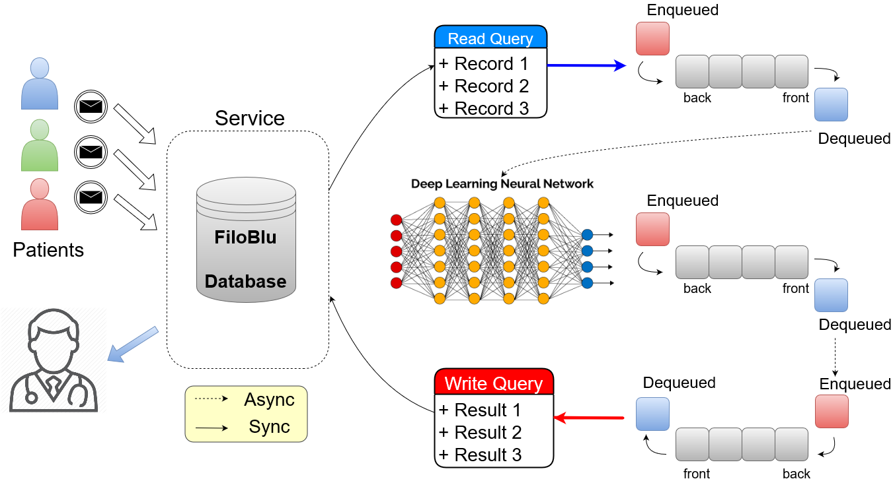

## FiloBlu Service

Nel progetto *FiloBlu* abbiamo un flusso di dati forniti da un'APP esterna che sono memorizzati in un database-server centrale.
Il servizio di Machine Learning deve leggere le informazioni archiviate in un database, elaborarle e infine scrivere i risultati nello stesso database.
Tutte queste operazioni devono essere eseguite ad alta frequenza poiché i risultati di output devono essere mostrati in un'applicazione in tempo reale.
Questa frequenza rappresenta il tempo di clock della funzione di processing, cioè ad ogni intervallo di tempo (piccola a piacere) verrà chiamato la funzione di processing che genererà i risultati desiderati in output.
Allo stesso tempo, dobbiamo occuparci del tempo richiesto dal nostro algoritmo di Machine Learning: non tutti gli algoritmi possono elaborare i dati in tempo reale e la frequenza della funzione di processing deve essere inferiore al tempo richiesto dall'algoritmo o rischiamo di  perdere alcune informazioni.

Possiamo ottenere la migliore efficienza da un servizio suddividendo il più possibile la funzionalità richiesta in compiti semplici e di piccole dimensioni.
I piccoli compiti possono essere valutati come funzioni indipendenti con una frequenza associata che in questo caso può essere ridotta il più possibile.
La funzionalità richiesta dal progetto *FiloBlu* può essere rivista come una sequenza di 3 passaggi fondamentali e altri 2 facoltativi: 1) leggere i dati dal database, 2) elaborare i dati con l'algoritmo di Machine Learning e 3) scrivere i risultati ottenuti nel database; 4) aggiornare il modello di Machine Learning e 5) cancellare i vecchi logfile sono passaggi opzionali.
Per migliorare ulteriormente l'efficienza del servizio, possiamo distribuire ogni step (indipendente) ad un thread diverso.
L'intera serie di attività è quindi pilotata da un thread principale (master) fornito dal servizio stesso.
In questo modo il servizio è efficiente dal punto di vista computazionale e inoltre non influisce sulle prestazioni del computer.
Dobbiamo tenere presente, infatti, che il computer che ospita il servizio deve essere affetto dal processo demone il meno possibile sia in memoria che in termini di efficienza computazionale.
L'ultimo passo è la sincronizzazione delle attività precedenti con le frequenze di clock appropriate.

Partiamo dalla funzione di lettura dei dati.
Poiché si presume che i nostri dati siano archiviati in un database, questa funzione deve eseguire una semplice query ed estrarre gli ultimi dati inseriti.
Ovviamente l'efficienza del passaggio si basa sull'efficienza della query scelta.
I dati estratti vengono salvati in un contenitore comune e condiviso tra l'elenco di thread a disposizione e quindi appartiene al thread-master.
La scelta di un contenitore appropriato è un secondo punto da considerare attentamente.
Questo contenitore deve essere leggero e sicuro (deve in ogni modo evitare la thread concurrency).
Mentre la seconda richiesta dipende dall'implementazione, la prima può essere affrontata usando un contenitore `FIFO` [^1].
In questo modo possiamo garantire che l'applicazione salverà una quantità fissa di dati e non occuperà gran parte della memoria (RAM).

Il secondo compito è identificato dalla funzione di Machine Learning che elabora i dati.
L'algoritmo prende i dati dal contenitore `FIFO` del passaggio precedente (se presenti) e salva i risultati in un secondo contenitore `FIFO` per il passaggio successivo.
La frequenza temporale del passaggio è data dal tempo richiesto dall'algoritmo di Machine Learning.

Il terzo passo prende i dati dal secondo contenitore `FIFO` (se presenti) ed esegue una seconda query (in questo caso in scrittura) nel database.
Anche in questo caso la frequenza è data dall'efficienza della query scelta.

Gli ultimi due passaggi possono essere eseguiti senza requisiti di tempo e sono utili solo su una scala temporale di grandi dimensioni.

Ogni passaggio esegue un logging indipendente su un singolo file condiviso.
Se si verifica un errore, il servizio registra un messaggio appropriato e salva il file di log corrente in una posizione diversa per impedire l'eventuale pulizia dei log (passaggio facoltativo).
Quindi il servizio viene riavviato.

Abbiamo implementato questo tipo di servizio in puro `Python` [[FiloBluService](https://github.com/Nico-Curti/FiloBluService)] ed il codice è rilasciato pubblicamente su Github.
Il servizio sviluppato è stato inoltre customizzato in base alle esigenze del progetto ed alle caratteristiche dei server coinvolti [^2].
Abbiamo scelto il linguaggio `Python` sia per la sua semplicità nella scrittura del codice sia per il suo modulo nativo di thread che garantisce una totale sicurezza delle variabili coinvolte.
Usando un set di decoratori di funzioni siamo in grado di eseguire ciascuna funzione (`callback`) in un thread separato e distaccato, come richiesto dalle precedenti istruzioni.
Il progetto include una completa documentazione sul suo utilizzo (anche per applicazioni generiche) e può essere facilmente installato via [`setup.py`](https://github.com/Nico-Curti/FiloBluService/blob/master/setup.py).
Nel progetto *FiloBlu* abbiamo usato un algoritmo di rete neurale scritto in `Tensorflow` come modello di Machine Learning.
`Tensorflow` non consente di eseguire direttamente il processo in background, quindi il problema è stato superato usando una chiamata diretta a uno script `Python` che esegua l'elenco completo dei passaggi in un ciclo infinito.
In questo modo il servizio può essere riavviato anche se questo è stato interrotto.
Il servizio può essere pilotato utilizzando il semplice script in [`Powershell`](https://github.com/Nico-Curti/FiloBluService/blob/master/filobluservice.ps1) fornito all'interno del pacchetto.

[^1]: il contenitore FIFO, ovvero *First-In-First-Out*, è una struttura dati speciale in cui il primo elemento aggiunto viene elaborato come primo e quindi rimosso automaticamente da esso.

[^2]: il servizio FiloBlu è un servizio Windows e non può essere eseguito su macchine Unix. Inoltre, il database utilizzato nel progetto è di tipo `MySQL`, quindi le query e le librerie utilizzate sono compatibili solo con questo tipo di database.

[**next >>**](./cryptography.md)
